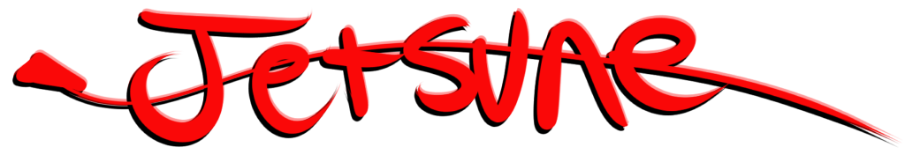

No more WebGL, download it on Itch.io!

[Jetsune Emberfall on Itch.io](https://sachiterasu-wolfy.itch.io/jetsune-1-emberfall-prototype)

Prototype flight "Chaser" bullet hell.

Dodge bullets and chase down the enemy! Build up speed and hit Mach to gain on the enemy and put them down with a devestating blow!

- W/S Pitch
- A/D Yaw
- M1/M2 Thrust
- Left + Right (M1 + M2) to use Powerup
- Space to Change Camera

**Changelog v0.10:**

- GPS fallback has been implemented so if players fly past the GPS, they will have a path to follow.
- Freelook has been implemented. You can use it with holding space or using side mouse buttons.
- Bullets now have sounds and colored impact effects, so that it feels better to dodge.
- Various minor improvements and Bug Fixes

Known Issues

- Player acceleration is sluggish above the intended 60FPS..
- First Time load is increasingly sluggish as the game gets more complex.
  - Might start considering individual platform builds.

Credits

- Sound effects
  - Touhou sound effects by ZUN/Team Shanghai Alice
- Skybox created on [https://www.manyworlds.run](https://www.manyworlds.run) courtesy of Rosebud.ai
- Missile code from [Tutorial](https://youtu.be/Z6qBeuN-H1M?si=wmq64OtvQFFeijn3) by Tarodev.
- Aces04 font (inspired by fonts from Project Aces) is created by Roach Typographics
  - [Font page](https://www.moddb.com/mods/aces-typografics/addons/aces04-true-type-font-family)
- "Post apocalyptic building - Lowpoly" (https://skfb.ly/ovpXC) by arca_done is licensed under Creative Commons Attribution (http://creativecommons.org/licenses/by/4.0/).

- Special Thanks
  - Lumikattlik and Bedacoalmaster for being there.
  - [MinusT](https://youtube.com/@0minust?si=e9V6mRUq_7vSmG6N) and [SituP](https://youtube.com/@situp4747?si=NLGkL_KUNuzrUmUg) on youtube for inspiration.
  - My professors for egging me on and pushing me.
  - And my long time discord friends.
